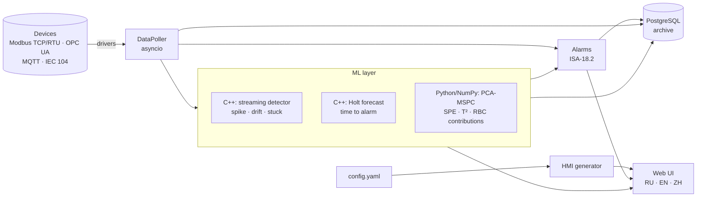

# SCADA Generator

[Русский](README.md) · **English** · [中文](README.zh.md)

> The SCADA that **builds itself** from a YAML description of the plant and
> **warns you in advance** — minutes before an alarm fires.

A conventional SCADA means weeks of hand-drawn mimic diagrams and threshold
alarms that fire when it is already too late. SCADA Generator works differently:

| | Conventional SCADA | SCADA Generator |
|---|---|---|
| Operator interface | drawn by hand in an editor | **generated** from `config.yaml`: units follow the process flow, elements are chosen by signal type |
| When the operator learns about a problem | when a value crosses a limit | **predicted alarm**: “vibration will reach limit H in 3 min 12 s” |
| Faults invisible to thresholds (leaks, sensor drift) | not visible | a **PCA model** detects broken relationships between signals and names the responsible tag |
| Message flood on start/stop | dozens of alarms | **root-cause grouping**: one “mode change” event |
| Alarm discipline | “write to the DB every second” | **ISA-18.2** state model, deadband, on-delay, acknowledgement, shelving, **EEMUA 191** KPIs |
| Equipment | one protocol or the vendor's own software | **Modbus TCP/RTU, OPC UA, MQTT, IEC 104** — any vendor, protocols can be mixed |
| Analytics | Python / cloud | **C++17 core** (pybind11), 4.5 M samples/s from Python, runs air-gapped |
| Languages | one | **Russian, English, Chinese** — UI, AI explanations, tag labels |
| Appearance | one theme | **light, dark or follow system** — switch in the header, remembered per browser |

## Quick start — demo in a minute

```bash
pip install -r requirements.txt
python run.py --demo --open
```

This opens `http://127.0.0.1:8000`. Demo mode starts a physical model of a pump
station (tank, pump with a PI level controller, variable consumer demand) and a
real Modbus TCP server. The ML models are pre-trained on 10 minutes of normal
operation. No PostgreSQL required.

On the **Demo scenarios** page you can inject a fault and watch the AI notice it
before the threshold alarms do:

| Scenario | What the AI sees | When (after onset) | Threshold alarm |
|---|---|---|---|
| Bearing wear | broken correlation → vibration drift → **predicted alarm** “H in ≈3 min” | 56 s / 74 s / 173 s | vibration H after 341 s |
| Pump trip | one “mode change” event + **predicted alarm** “level L in ≈4.5 min” | 0 s / 114 s | level L after 384 s |
| Tank leak | broken correlation (inflow/outflow balance) | 18 s | **never fires** |
| Temperature sensor drift | `bearing_temp` drift, 86–90 % contribution | 63 s | does not fire within 10 min |
| Stuck pressure sensor | “value has not changed — looks like a stuck sensor” | 14 s | never fires |
| Current loop interference | spikes marked on the trend | 1–9 s | — |

The figures come from a run on the same model that the automated tests
(`tests/test_ml.py`) use. During 10 minutes of normal operation there are no
predicted alarms and no drifts; only occasional noise spikes are possible.

## How it works



- **Streaming detector (C++, O(1) memory per tag).** A robust EWMA model with
  Huber clipping produces the expected value and the “normal band” shown on the
  trends. Spike: |z| above the threshold. Drift: the smoothed signal stays away
  from a long-term baseline (with hysteresis — unlike CUSUM it does not fire on
  autocorrelated signals such as cyclic demand). Stuck: a normally noisy signal
  stops changing. A value at the range boundary (0, min, max) is not treated as
  stuck — that is stopped equipment.
- **Time-to-alarm forecast (C++).** Holt double exponential smoothing with
  irregular time steps. A forecast is issued only when the current trend is
  unusual for the tag (compared with its learned normal trend), spikes do not
  bend the trend, and the extrapolation never reaches further than 4× the
  duration of the observed tendency, so a mode step settled by a controller does
  not become a false predicted alarm.
- **Multivariate model (PCA-MSPC).** Learns how plant signals move together; SPE
  flags a “new pattern”, T² a “familiar but too strong” one. Tag contributions
  use reconstruction-based contribution on the combined index (Alcala & Qin;
  Yue & Qin), so the model points at the real culprit instead of smearing the
  fault across correlated tags. The model is saved to `models/` and retrained
  when the tag list changes.
- **C++ and Python give identical results.** Every core algorithm is mirrored in
  `scada_core/ml/fallback.py`; `tests/test_native_parity.py` checks agreement to
  1e-9. Without a compiler the system runs on Python — slower, equally accurate.

| Detector throughput | samples/s |
|---|---|
| pure C++ (`DetectorBank`, 1000 tags) | ~41 M |
| C++ from Python (one call per poll cycle, GIL released) | ~4.5 M |
| Python fallback | ~0.4 M |

## Configuration

Everything lives in `configs/config.yaml`. A minimal tag needs only `name` and
`address`; see the Russian README for the full field reference — field names are
the same: `type`, `scale`, `offset`, `unit`, `min`, `max`, `alarm_hh`,
`alarm_high`, `alarm_low`, `alarm_ll`, `deadband`, `on_delay_s`, `group`,
`widget`, `writable`, `ml`, `label: {ru, en, zh}`. The configuration is
validated at startup, and every error is reported with its path. Values can
come from the environment: `host: ${PLC_HOST:-localhost}`. On the
**Generator** page you can paste the YAML of any other plant (a boiler-house
example is included), see its process view instantly and download SVG or JSON.

## Protocols: equipment from any vendor

SCADA Generator is not tied to any vendor. Devices connect over open standards, and
protocols can be mixed in one plant. Alarms, AI, the process view and the archive
work the same for all of them. The protocol is one line on the device.

| `protocol` | Use | Tag address | Library (license) |
|---|---|---|---|
| `modbus_tcp` | PLCs, gateways, drives over Ethernet | `address` + `function` | pyModbusTCP (MIT), built in |
| `modbus_rtu` | RS-485/RS-232, RTU-over-TCP gateways (`socket://`), RFC 2217 | `address` + `function` | pyserial (BSD) |
| `opcua` | OPC UA (IEC 62541) PLCs and servers of any vendor | `node: "ns=2;s=…"` | asyncua (LGPL-3.0) |
| `mqtt` | IIoT gateways, wireless sensors, Mosquitto/EMQX | `topic` (+ `json_path`) | aiomqtt (BSD) |
| `iec104` | telecontrol, substations (IEC 60870-5-104) | `ioa` | c104 (GPL-3.0) |

Drivers are optional: install only what you need (`pip install asyncua`, or everything
with `pip install -r requirements-protocols.txt`). A device whose library is missing is
shown offline with a clear reason; the others keep working. A full five-protocol
example is in `configs/examples/multi_protocol.yaml`. Every driver is tested against a
real server or emulator: reads, writes, device errors, link loss and recovery.

## Docker

```bash
docker build -t scada-generator .
docker run --rm -p 127.0.0.1:8000:8000 scada-generator        # demo
SCADA_API_TOKEN=secret DB_PASSWORD=pass docker compose up --build
```

`docker compose` starts the full stack: PLC emulator, PostgreSQL and SCADA in
production mode. For a real plant remove the `plc-sim` service and set
`PLC_HOST`/`PLC_PORT`. The image builds and tests the C++ core, runs as an
unprivileged user and has a `HEALTHCHECK`.

## Production use

```bash
cp .env.example .env          # DB_*, SCADA_API_TOKEN, device addresses
pip install -r requirements-protocols.txt   # RTU, OPC UA, MQTT, IEC 104 drivers (if needed)
python run.py --check         # test the link to every device; writes nothing
python run.py                 # polling + archive + UI
python run.py --no-web        # headless service (as in 0.x)
python run.py --no-db         # without PostgreSQL
```

- **Commissioning:** `--check` connects to every configured device, reads all tags
  and exits with 0 when everything is fine or 1 otherwise, with a one-line reason
  per device — handy for site acceptance and deployment scripts.
- **PostgreSQL:** versioned migrations (`schema_migrations`). A 0.x database is
  upgraded automatically: timestamps become `TIMESTAMPTZ` with no loss of
  instants, an index on `(tag_id, timestamp)` is added, and each alarm is one row
  per activation with ack and return times. Values are written in batches from a
  background queue.
- **Security:** binds to `127.0.0.1` by default. With `SCADA_API_TOKEN` set,
  control commands require an `X-API-Token` header. Writes are allowed only for
  `writable: true` tags within `min..max`, and every command is journaled. No
  CDN or external fonts are used — the UI works on isolated control networks.
- **Monitoring:** `/api/health` returns 200 or 503 (device or database down, the reason is in
  `device_errors`),
  `/api/health/live` is a liveness probe.
- **API:** see the table in the Russian README or the interactive docs at `/docs`.

## Build and test

```bash
pip install -r requirements-dev.txt
python scripts/build_native.py                   # CMake + ctest
python -m pytest -q                              # 88 tests, the emulator starts inside
SCADA_FORCE_PYTHON_CORE=1 python -m pytest -q    # same on the Python core
ruff check . && ruff format --check .
```

## Current limitations

- Protocols: Modbus TCP/RTU, OPC UA, MQTT, IEC 60870-5-104. BACnet, PROFINET and
  EtherNet/IP are not supported yet; such equipment is usually connected via an OPC UA gateway. The proprietary Siemens S7
  protocol is not implemented: S7-1200 (firmware 4.4+) and S7-1500 have a built-in OPC UA
  server, other models can use Modbus TCP or a gateway.
- OPC UA is polled; subscriptions (monitored items) are not used yet.
- Single node without redundancy; access control is one operator token, no roles.
- The PCA model is static; attribution is less accurate for processes with long
  dead times than a dynamic model would be.
- Predicted alarms extrapolate trends: they warn about developing conditions,
  not about sudden failures.

## License

MIT — see [LICENSE.md](LICENSE.md). Contact: Anton Sergeev · kavery@mail.ru
